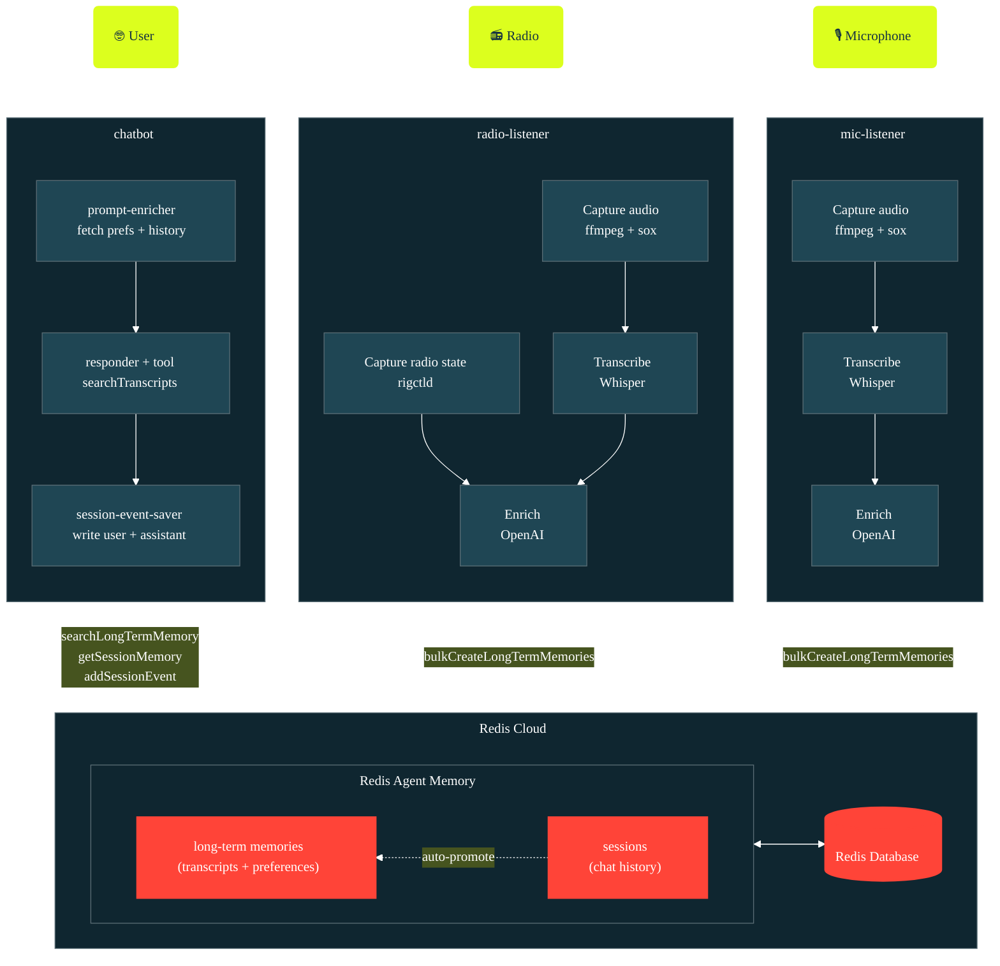

# Redis Agent Memory Audio Capture (Redis + OpenAI Whisper)

**Earshot** is a multi-agent demo of [Redis Agent Memory](https://redis.io/agent-memory/)—part of [Redis Iris](https://redis.io/iris). Independent listener processes capture audio from ambient sources, transcribe and enrich it, and write each utterance to long-term memory. A separate chatbot reads from the same memories and answers questions about what was heard.

> **Earshot** is able to listen on microphones, of course, but it can also listen to radio transmissions over some amateur radio equipment. In this scenario, it will also grab metadata including the frequency, radio band, and the mode of operation (AM/FM/SSB).

## Table of Contents

- [Demo Objectives](#demo-objectives)
- [Setup](#setup)
- [Running the Demo](#running-the-demo)
- [Architecture](#architecture)
- [Resources](#resources)
- [Maintainers](#maintainers)
- [License](#license)

## Demo Objectives

- Demonstrate **Redis Agent Memory** as a shared coordination layer for multiple, independent agents
- Show **long-term memory** as a durable, searchable, and sharable store of a variety of data
- Illustrate **session memory** with auto-promotion of session events into long-term memory

## Setup

### Dependencies

- **Node.js 24** (see [.nvmrc](.nvmrc))
- **ffmpeg** and **sox** — audio capture pipeline
- **hamlib** — only needed if you are listening to a radio (provides `rigctld`)
- A **Redis Agent Memory** store (host, store ID, API key) — [sign up free at redis.io/try-free](https://redis.io/try-free/)
- An **OpenAI API key** — used for Whisper transcription and the chat / enricher models

On macOS:

```sh
brew install ffmpeg sox hamlib
```

### Configuration

```sh
cp .env.example .env       # then fill in the values
npm install
npm run build
```

Open [.env](.env) and set at minimum:

- `MEMORY_API_HOST`, `MEMORY_API_KEY`, `MEMORY_STORE_ID` — your Agent Memory store
- `OPENAI_API_KEY` — your OpenAI key
- `USER_NAME` — who you are to the chatbot (your name or callsign)
- `MIC_AUDIO_DEVICE` — audio input for the mic-listener (required if you run it)
- `RADIO_AUDIO_DEVICE` — audio input for the radio-listener (required if you run it)

Each listener has its own audio device, output directory, and location context, so you can run the mic- and radio-listeners side by side from different sources. If you're running with a radio also set `RIG_PORT`, `RIG_BAUD`, and `RIG_MODEL`.

To discover device names and serial ports on your machine:

```sh
npm run devices
```

This lists audio inputs (use one for `MIC_AUDIO_DEVICE` / `RADIO_AUDIO_DEVICE`) and serial ports (use one for `RIG_PORT`).

See [.env.example](.env.example) for the complete list with comments. Summary:

| Variable                       | Purpose                                                         |
| ------------------------------ | --------------------------------------------------------------- |
| `MEMORY_API_HOST`              | Redis Agent Memory endpoint                                     |
| `MEMORY_API_KEY`               | Redis Agent Memory API key                                      |
| `MEMORY_STORE_ID`              | Redis Agent Memory store ID                                     |
| `OPENAI_API_KEY`               | OpenAI key — Whisper + chat models                              |
| `USER_NAME`                    | Your identity in chatbot sessions                               |
| `LISTENER_OWNER_ID`            | Shared owner id for listeners + chatbot (set in `.env.example`) |
| `MIC_AUDIO_DEVICE`             | Mic-listener audio input — name or avfoundation index           |
| `MIC_AUDIO_OUTPUT_DIR`         | Where mic-listener WAVs go (default `./captures/mic`)           |
| `MIC_AUDIO_LOCATION_CONTEXT`   | Optional — location hints to help correct mic transcripts       |
| `RADIO_AUDIO_DEVICE`           | Radio-listener audio input — name or avfoundation index         |
| `RADIO_AUDIO_OUTPUT_DIR`       | Where radio-listener WAVs go (default `./captures/radio`)       |
| `RADIO_AUDIO_LOCATION_CONTEXT` | Optional — location hints to help correct radio transcripts     |
| `RIG_PORT`                     | Serial port for `rigctld` (radio-listener only)                 |
| `RIG_BAUD`                     | Serial baud rate (radio-listener only)                          |
| `RIG_MODEL`                    | Hamlib rig model number — see `rigctl --list`                   |

## Running the Demo

Each command runs one of the three processes. Open a separate terminal for each.

```sh
npm run chat               # chatbot REPL — no hardware needed
npm run mic-listen         # mic capture loop — needs audio only
npm run radio-listen       # radio capture loop — needs rig + audio
```

Stop any process with `Ctrl-C`.

There are matching `:dev` scripts (`chat:dev`, `mic-listen:dev`, `radio-listen:dev`) that run from TypeScript sources via `tsx` and skip the build step.

### Path A — without a radio

Best for getting started. In one terminal, capture ambient audio from your mic:

```sh
npm run mic-listen
```

Talk near the microphone and then pause for a couple of seconds. Your utterance is recorded, transcribed, printed to stdout, and written to long-term memory.

In a second terminal, open the chatbot:

```sh
npm run chat
```

Ask it about what was said. It calls `searchTranscripts` under the hood and pulls matching memories from the store.

### Path B — with a Yaesu FT-991a

Same idea, but pulls from the radio:

```sh
npm run radio-listen       # in one terminal
npm run chat               # in another
```

The radio-listener spawns `rigctld`, polls frequency and mode every 100 ms, and snapshots that metadata with each captured transmission. The enricher additionally extracts callsigns and frequency mentions from the transcribed text.

FT-991a specifics:

- The rig enumerates as **two** USB-serial devices. The CAT port is the one you want for `RIG_PORT`. `npm run devices` lists both — confirm by trial.
- On macOS, use the `/dev/cu.*` path, not `/dev/tty.*`.

## Architecture

Audio is captured by one or more independent listener processes, transcribed with Whisper, enriched with OpenAI, and written to Redis Agent Memory as long-term memories. The chatbot runs separately and answers questions by semantically searching those same memories — the listeners and chatbot share no state except the Redis store.

The project ships with two listeners:

- **mic-listener** — captures from any microphone. No special hardware needed. Corrects the transcript and extracts named entities (people, places, organizations).
- **radio-listener** — captures from a Yaesu FT-991 amateur radio via hamlib's `rigctld`. Does the same named-entity extraction as the mic-listener, plus ham-specific extraction of callsigns and frequencies and a snapshot of rig metadata.

The three processes (`mic-listener`, `radio-listener`, `chatbot`) are independent. Each can run on its own. They never talk directly — all coordination happens through the shared Agent Memory store.

> If you don't own a radio, you can still run the full demo using the mic-listener and chatbot. The radio-listener is optional.



## Resources

- [Redis Iris](https://redis.io/iris)
- [Redis Agent Memory](https://redis.io/agent-memory/)
- [Redis Agent Skills](https://github.com/redis/agent-skills)
- [hamlib / `rigctld`](https://hamlib.github.io/)
- [OpenAI Whisper](https://platform.openai.com/docs/guides/speech-to-text)

This application uses [Redis Iris](https://redis.io/iris).


Additional Redis Iris product diagrams live in [assets/](assets/):

- [Redis Agent Memory](assets/redis-agent-memory.png)
- [Redis Context Retriever](assets/redis-context-retriever.png)
- [Redis Data Integrator](assets/redis-data-integrator.png)
- [LangCache](assets/redis-lang-cache.png)

## Maintainers

- Guy Royse — [guyroyse](https://github.com/guyroyse)

## License

MIT — see [LICENSE](LICENSE).
